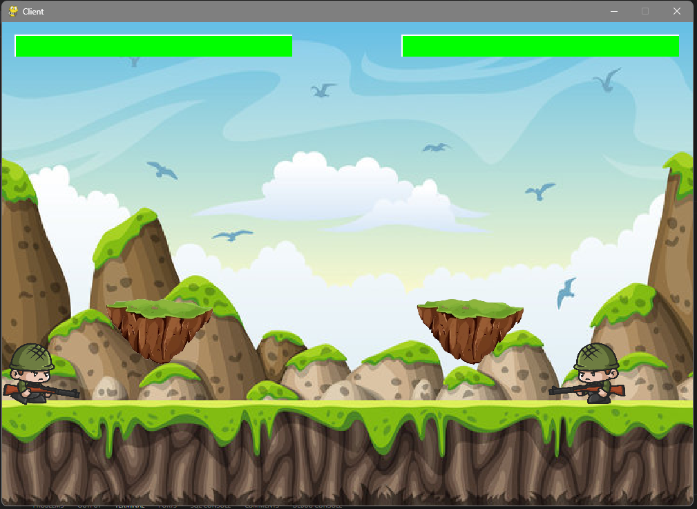

See more here: 

```bash
https://phamtranmyduyen.github.io/Introduce_Game/#pygame
```

# Project Name

Little Commander is a two-player shooting game that can be played over a LAN connection and is built using the PyGame library.



## Requirement
- Python 3.0 or higher
- PyGame 

## Installation

Clone the repository by running the following command in your terminal:
```bash
git clone https://github.com/khatuanlam/Little_Commander.git
```
Update Python's latest version
```bash
python --version
```

Use the package manager [pip](https://pip.pypa.io/en/stable/) to install PyGame.
```bash
pip install pygame
```


## Usage

**1.**  Open folder Build

**2.**  Run server.exe

**3.**  Run client.exe
 
**4.**  Waiting for another gamer to join

**5.**  Playing game
 
## Contact

If you have any questions or suggestions regarding this project, please feel free to contact me. We appreciate your feedback and will do our best to respond to your inquiries promptly.

Thank you for your interest in our project!